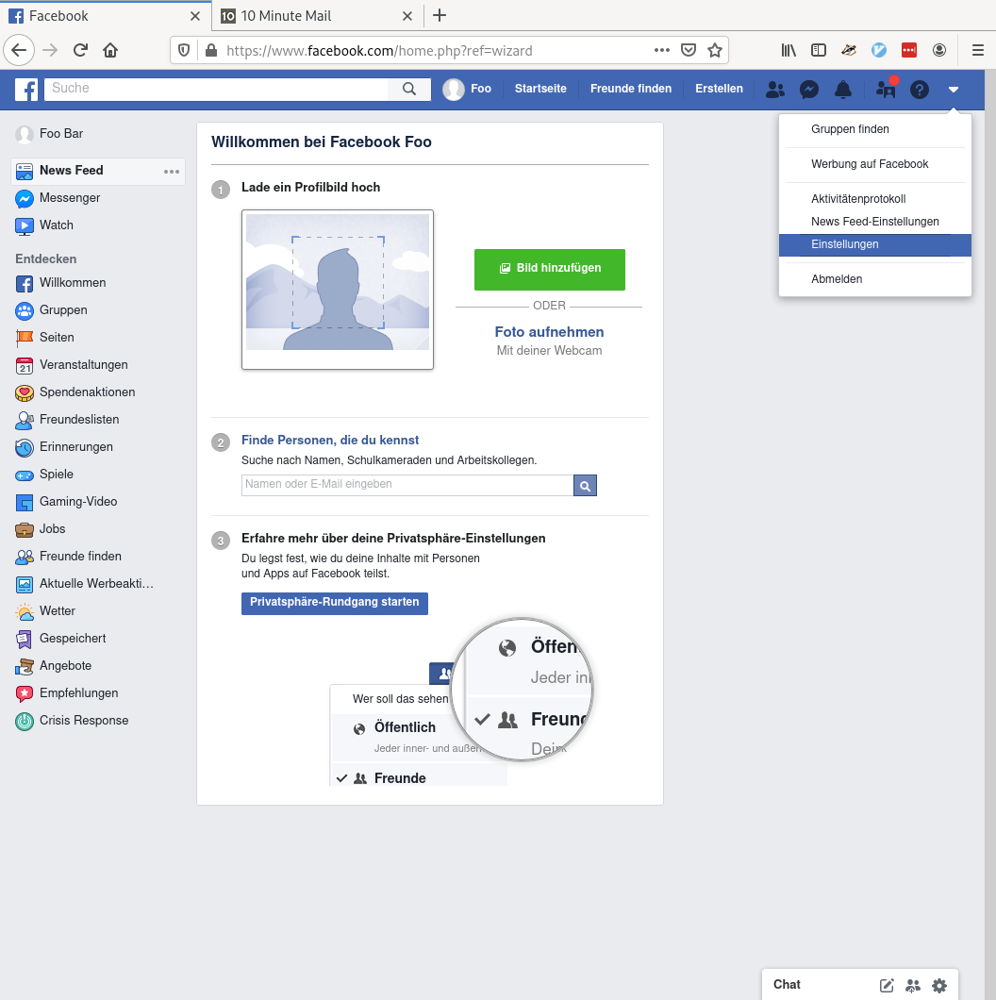
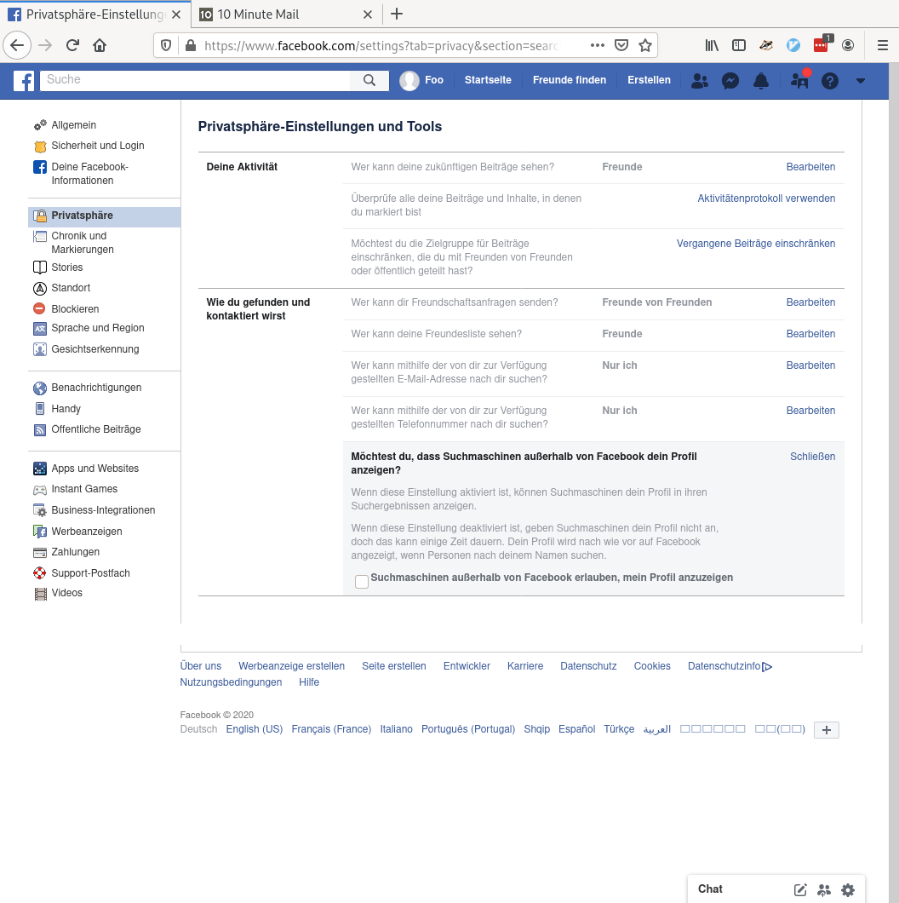
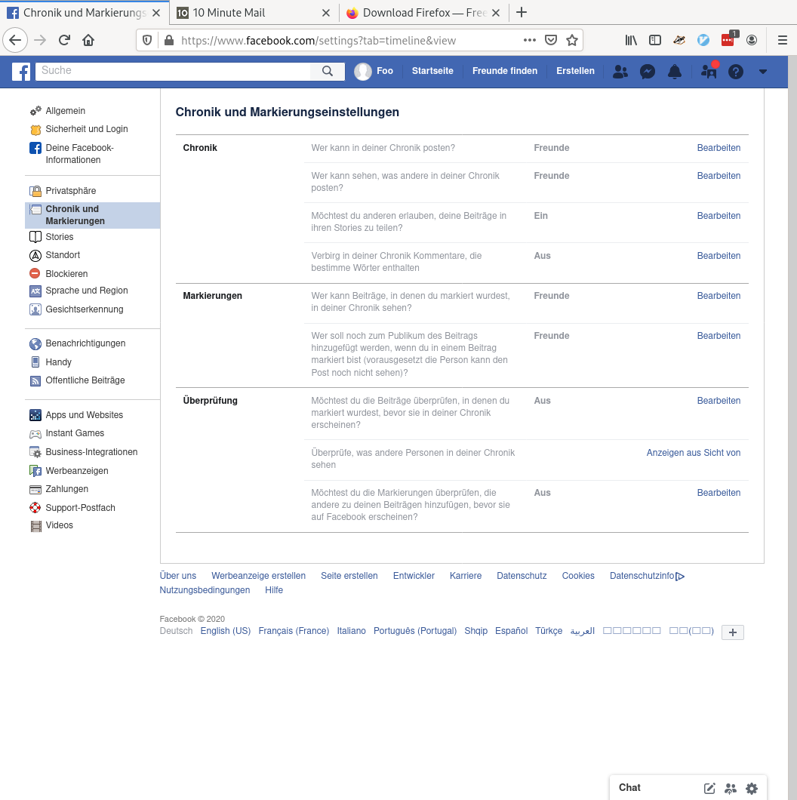
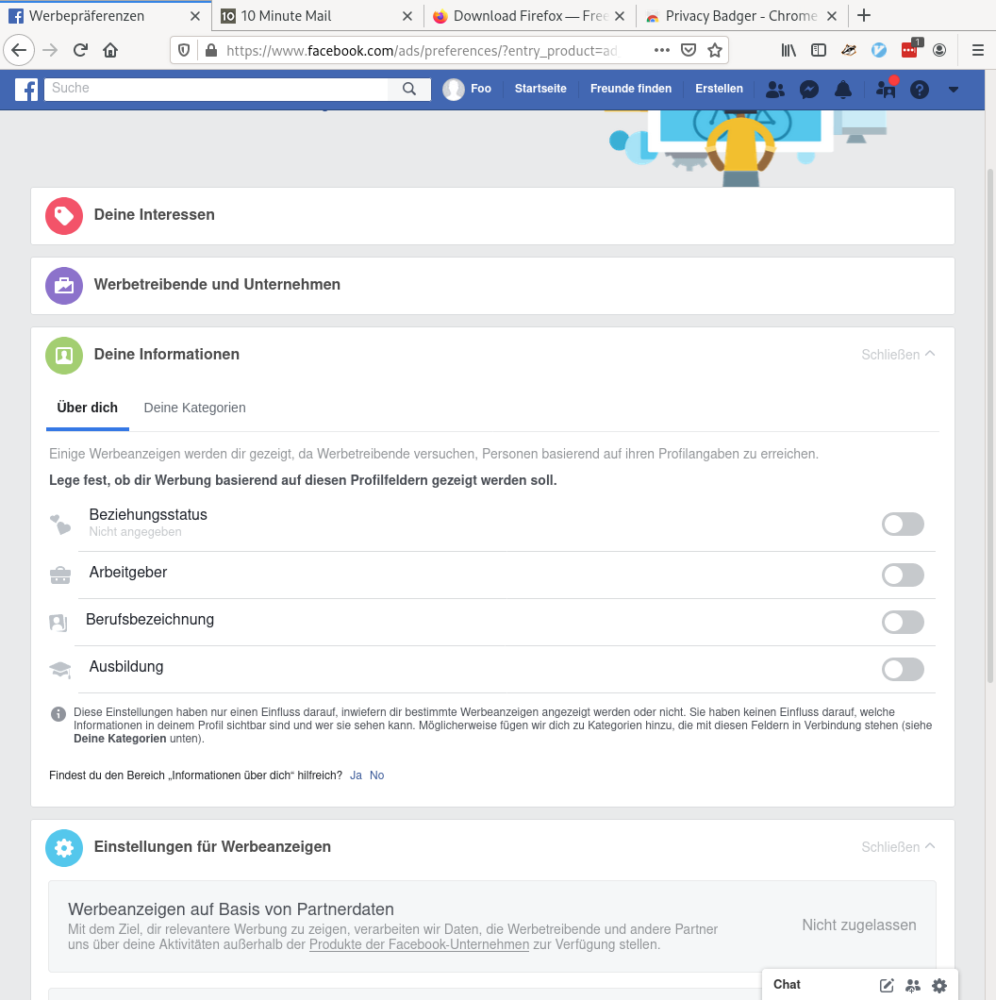
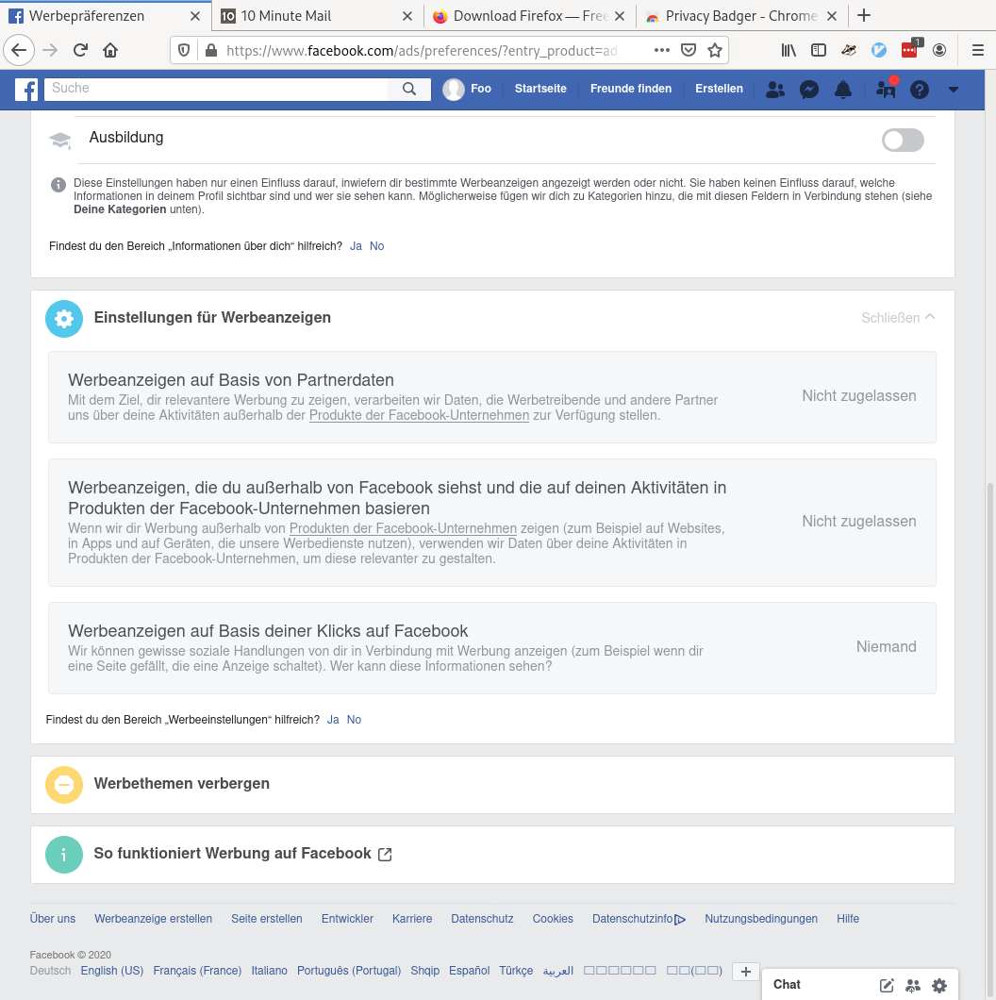

# Facebook Account erstellen

 1. Gehe mit dem Webbrowser deiner Wahl auf
    https://de-de.facebook.com/
 2. Gib rechts deinen Vor- und Nachnamen sowie eine E-Mail Adresse an.
    (Du kannst auch Fantasienamen angeben)
 3. Wähle ein sicheres Passwort
 4. Ihr bekommt eine E-Mail mit einer 6 stelligen Nummer mit der ihr
    die E-Mail Adresse bestätigt.

# Einstellungen

Klicke rechts oben auf den Pfeil und wähle Einstellungen.

Dann gehe auf Privatsphäre und passe die Einstellungen an:

Als nächstes Chronik und Markierungen

Beim Abschnitt Gesichtserkennung könnt ihr diese ausschalten.

Gehe dann auf Werbeanzeigen. Klicke auf den Reiter "Deine Informationen" und
deaktiviere das Weitergeben aller Informationen an Werbetreibende:

Klicke dann auf den Reiter "Einstellungen für Werbeanzeigen" und
deaktiviere dass deine Aktionen für Werbezwecke verwendet werden.

# Anhang

## Webbrowser

Ich empfehle [Firefox](https://www.mozilla.org/en-US/firefox/new/) von
Mozilla als Webbrowser. Mozilla wird von einer Non-Profit Organisation
geführt und hat somit weniger kommerzielle Interessen als zum Beispiel
Google welche den Chrome Browser zur Verfügung stellen. Auch blockt
Firefox das Verfolgen (Tracken) von Deinen Aktivitäten im Internet.

Wollt ihr trotzdem Chrome verwenden, empfehle ich die Erweiterung
["Privacy Badger"](https://chrome.google.com/webstore/detail/privacy-badger/pkehgijcmpdhfbdbbnkijodmdjhbjlgp)
zu installieren, welche Ebenfalls Tracker blockiert.

## 10minutemail
Willst Du nicht deine richtige E-Mail verwenden kannst Du
https://10minutemail.net/ verwenden. Das hat dann aber den Nachteil,
dass Du den Account nicht zurücksetzen kannst wenn Du das Passwort mal
vergisst.
